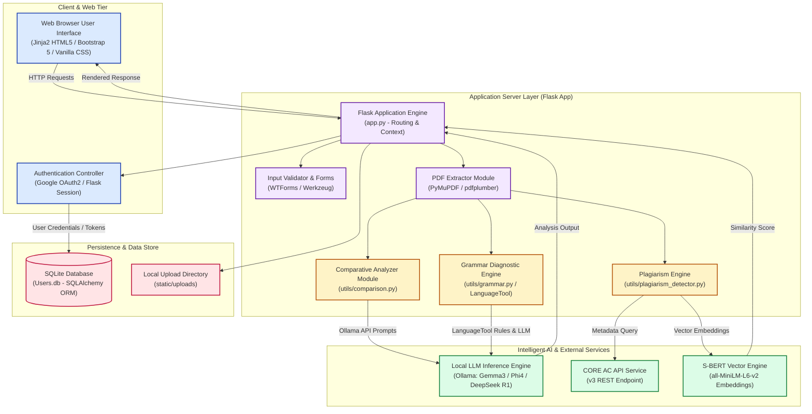
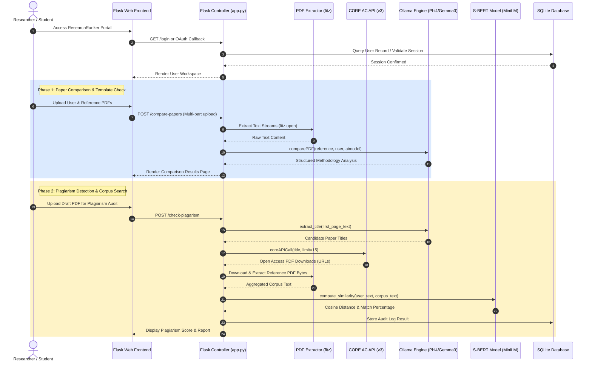
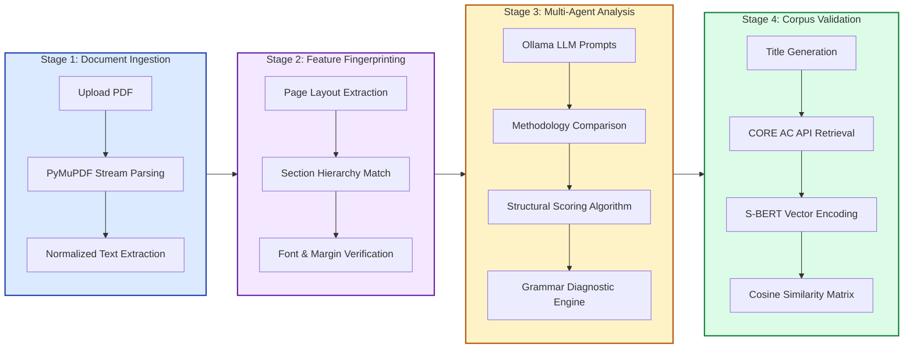
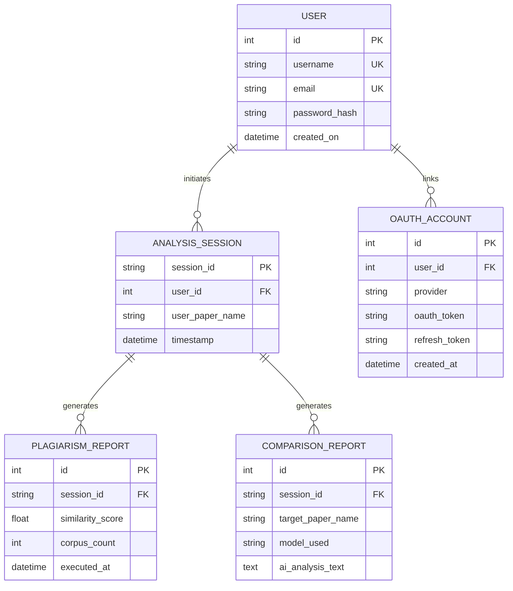
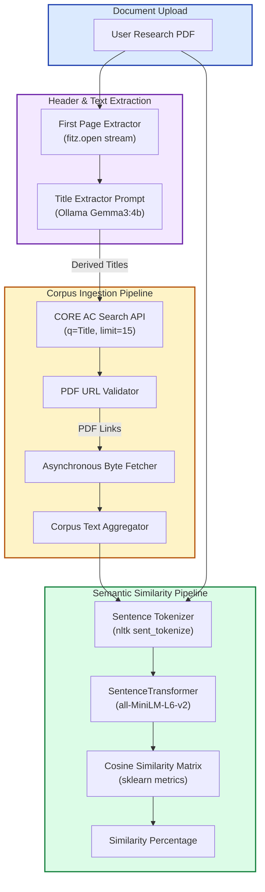

# ResearchRanker Diagram Specification Library

This document serves as the master specification repository for all architectural, sequence, workflow, and relational diagrams supporting the **ResearchRanker** platform. Pre-rendered high-resolution PNG figures generated from these sources are embedded in [README.md](file:///home/snehal-reddy/Coding/Repositories/ResearchRanker/README.md).

---

## Table of Contents

1. [High-Level System Architecture](#1-high-level-system-architecture)
2. [End-to-End System Sequence Flow](#2-end-to-end-system-sequence-flow)
3. [Multi-Agent Analysis Pipeline Stages](#3-multi-agent-analysis-pipeline-stages)
4. [Relational Database ER Schema](#4-relational-database-er-schema)
5. [Automated Data Ingestion & Plagiarism Pipeline](#5-automated-data-ingestion--plagiarism-pipeline)

---

## 1. High-Level System Architecture

- **Source File**: [system_architecture.mmd](file:///home/snehal-reddy/Coding/Repositories/ResearchRanker/docs/diagrams/system_architecture.mmd)
- **Rendered Figure**: [system_architecture.png](file:///home/snehal-reddy/Coding/Repositories/ResearchRanker/docs/diagrams/system_architecture.png)

---

## 2. End-to-End System Sequence Flow

- **Source File**: [sequence_flow.mmd](file:///home/snehal-reddy/Coding/Repositories/ResearchRanker/docs/diagrams/sequence_flow.mmd)
- **Rendered Figure**: [sequence_flow.png](file:///home/snehal-reddy/Coding/Repositories/ResearchRanker/docs/diagrams/sequence_flow.png)

---

## 3. Multi-Agent Analysis Pipeline Stages

- **Source File**: [pipeline_stages.mmd](file:///home/snehal-reddy/Coding/Repositories/ResearchRanker/docs/diagrams/pipeline_stages.mmd)
- **Rendered Figure**: [pipeline_stages.png](file:///home/snehal-reddy/Coding/Repositories/ResearchRanker/docs/diagrams/pipeline_stages.png)

---

## 4. Relational Database ER Schema

- **Source File**: [er_schema.mmd](file:///home/snehal-reddy/Coding/Repositories/ResearchRanker/docs/diagrams/er_schema.mmd)
- **Rendered Figure**: [er_schema.png](file:///home/snehal-reddy/Coding/Repositories/ResearchRanker/docs/diagrams/er_schema.png)

---

## 5. Automated Data Ingestion & Plagiarism Pipeline

- **Source File**: [data_ingestion.mmd](file:///home/snehal-reddy/Coding/Repositories/ResearchRanker/docs/diagrams/data_ingestion.mmd)
- **Rendered Figure**: [data_ingestion.png](file:///home/snehal-reddy/Coding/Repositories/ResearchRanker/docs/diagrams/data_ingestion.png)

